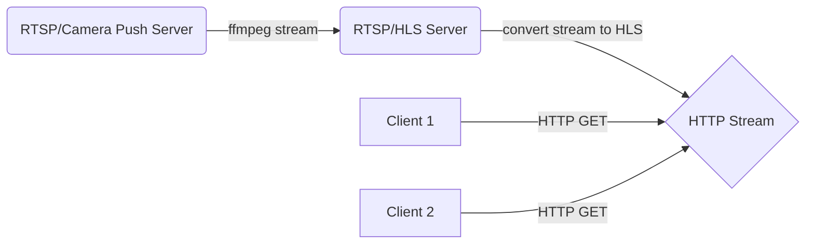

# RTSPCP

RTSPCP is meant to be a secure RTSP push to HTTP HLS streaming application.

## Flow

```mermaid
flowchart LR

A(RTSP/Camera Push Server) -->|ffmpeg stream| B(RTSP/HLS Server)
B -->|convert stream to HLS| C{HTTP Stream}
D[Client 1] -->|HTTP GET| C
E[Client 2] -->|HTTP GET| C
```
